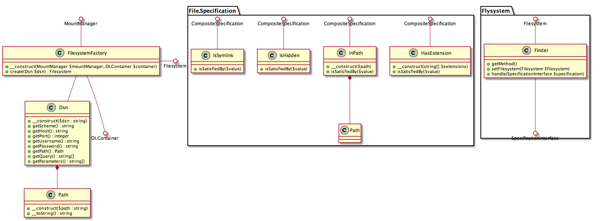

Collecting files
================

Document Groups need to retrieve a series of physical files that can be parsed and transformed into the Documentation
structure. In order to achieve this we need a Service that consumes and configures Flysystem based on a DSN. After that
it uses a series of SPECIFICATIONS to collect one or more files.

    This functionality replaces phpDocumentor’s Fileset component. The Fileset component suffers from problems when it
    comes to testing large folder structures of which most is ignore (for example, a source folder containing a
    ‘vendor’ folder; the vendor folder should not even be checked but the Symfony Finder will still retrieve all files.
    This causes delays of up to 10 seconds). Another benefit of this new system is that it will allow the user to load
    files from remote locations, such as github.

In the Class Diagram above you can see the concepts that need to be realized. Technically speaking this is separated
into three parts:

1. Creating a Filesystem entity using a Factory
2. Creating a Flysystem plugin to add File finding capabilities to the Filesystem entity
3. Adding Specification classes to apply when finding files using the `find()` method introduced by the previous plugin

Creating a Filesystem entity
----------------------------

Flysystem provides an entity named Filesystem that perfectly represents a Filesystem entity that we want to use with
phpDocumentor to find and read files.

Flysystem however has no method to create a Filesystem entity (and its storage adapter) using a DSN string; as such we
need to create our own Factory to provide for that.

What is a DSN
+++++++++++++

A DSN (Data Source Name) is a string that identifies the type and location of a Data Source. Although there is no
standardized format for a DSN we are going to base ours on RFC 3986, the representation of a URI. Because we need to
be able to provide parameters to the DSN we are going to amend the RFC 3986 with a parameter notation (that is
supported by RFC 3986).

Let’s show a few examples:

- git+http://github.com/phpDocumentor/phpDocumentor2;branch=develop
- file://src
- src

In the first example you can see that we want to parse a git location using the http protocol (git supports
multiple protocols) where the repository is located at github.com/phpDocumentor/phpDocumentor2 with the parameter
branch that has value 'develop'.

In the second and third example we see a simple example of a DSN that points towards the relative path ‘src’ on the
local filesystem.

    Please note that this is relative to the configuration file or if the path is provided on the command line to the
    current working directory.

This does mean that if there is no scheme (the `file://` part) that `file://` is assumed for simplicity.

Php has a utility function named `parse_url` that can be used to parse the DSN; some tweaks are however necessary.
Examples of this are splitting the parameters off first because parse_url does not understand the `;` character and
when the `file://src` DSN is used that src is not a hostname but a path (due to the `file://`, local files don’t have
a hostname). This is parsing should be done in the DSN Value Object.

Creating a Filesystem Entity
++++++++++++++++++++++++++++

The FilesystemFactory is responsible for converting a DSN object into a Filesystem Entity (including the right
adapter) and adding the newly created `phpDocumentor\Flysystem\FinderPlugin` plugin onto it (see the next chapter for
more information on this Plugin).

In the class diagram you can see that the Flysystem Mount Manager is required by the FilesystemFactory. We can use this
to store and retrieve created Filesystem objects so that we do not have to recreate it if a DSN is used twice. A hash
of the DSN can be used as an identifier internal to the FilesystemFactory for a Filesystem Entity.

Part of creating a Filesystem Entity is selecting and creating the right Flysystem Adapter to use and applying the
correct decorators. Because Flysystem adapters can depend on any number of dependencies we will be injecting the
Container so that the dependencies for an Adapter can be retrieved.

    Usually you would create an AdapterFactory to create the adapters, and have that query the container for
    dependencies, but in this instance I have chosen not to to keep the architecture simpler and because I do not
    think phpDocumentor should care about Adapters in its Domain Model. A Filesystem object is however a Domain Model
    concept, even if it is part of Flysystem (which belongs to the Infrastructure Layer).

In order to determine which Adapter, decorator and plugins should be created we can examine the ‘Scheme’ of the DSN.
This determines the type of transport and thus which adapter should be created.

Initially we will be supporting three schemes:

1. `file` – the local file system, which is represented by the ‘Local’ Adapter
2. `git+http` – A git repository that is cloned in the ‘tmp’ folder, this is represented by the ‘CloneRemoteGitToLocal’
   adapter (https://github.com/potherca/flysystem-readonly-git-adapter)
3. `git+https` – which is an alias for `git+http` only we connect over https instead of http.

After the Adapter and Filesystem is created we need to add the Flysystem Finder Plugin onto the Filesystem entity, as
described in the next chapter, as that will add search capabilities to the Flysystem.

Flysystem Finder Plugin
-----------------------

Specifications for the Finder
-----------------------------

