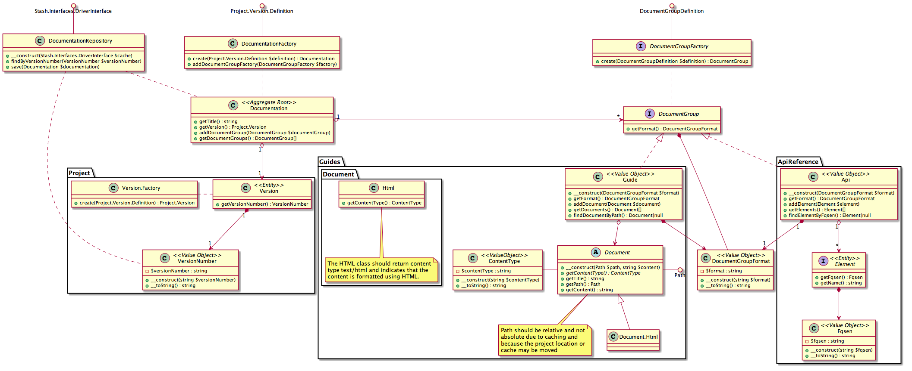

Documentation
-------------

The Documentation AGGREGATE is the largest AGGREGATE in phpDocumentor as it represents a single set of Documentation
for a Version in a Project.

The Documentation AGGREGATE can be created by instantiating a Version Definition AGGREGATE and passing that to the
Documentation FACTORY. The Version Definition will contain all information needed to create a set of Documentation,
including the location of API References and Guides.

A pre-existing Documentation AGGREGATE can also be retrieved using the Documentation REPOSITORY or using that same
REPOSITORY it can be persisted to disk.

.. info:: The Documentation AGGREGATE can become quite large and it takes some time to load and persist it.

When you retrieve a Documentation instance from the REPOSITORY the FACTORY will use the data from disk to reconstitute
the Documentation instance to be identical to the moment when it was persisted. This means that if any of the source
files for that instance of the Documentation has changed since it was persisted that those changes won't show.

In order to update the Documentation with the latest changes in its source files you can call the ``update`` method of
the Documentation FACTORY. This method will re-evaluate the Documentation AGGREGATE and update it with the new
information in the source files.

.. info::
   You can also create a new Documentation instance using the FACTORY but this will take more time as it will parse
   all files, instead of only the files that have changed.

